<!-- 🎛️ PRESENTACIÓN — CARTEL MARQUESINA RETRO (self-hosted) -->

  

<!-- contador (déjalo como ya lo tienes) -->

  

<!-- ============================ -->
<!--           ABOUT ME           -->
<!-- ============================ -->
<table>
<tr>
<td width="50%" valign="top">

<h3>🕹️ About me</h3>

- 🔭 I’m currently working on **I am going to start a project where I will teach courses on Java from Scratch**
- 🧠 Focus: Backend & web (Java, Python, Django, JS)
- 💻 OS I use: **Linux** & **Windows** (Microsoft ecosystem)
- 🗣️ English: **Intermediate**
- 📫 Contact: **eduardobgg20@ciencias.unam.mx**
- ⚡ Fun fact: **HTML, Java & Python practice; improving step by step and always learning**

<!-- PIXEL ART (conservado: Sombra) -->

  

</td>
<td width="50%" valign="top">

<!-- ============================ -->
<!--         TECH STACK           -->
<!-- ============================ -->
<h3>🌈 Tech stack</h3>

<!-- Lenguajes -->

  
  
  
  
  
  

<!-- SO / Tools -->

  
  
  
  

<!-- PIXEL ART (conservado: Bastion) -->

  

</td>
</tr>
</table>

<!-- ===================================================== -->
<!--        🎮 PIXEL GITHUB STATS (con temas y cards)      -->
<!-- ===================================================== -->

<!-- Encabezado animado con fuente tipo terminal/pixel -->

  

<!-- Fila 1: Stats principal + Top Langs (donut vertical) -->

  <!-- Esquinas cuadradas (border_radius=0) y paleta retro -->
  
  

<!-- Fila 2: Streak con colores 8-bit -->

  

<!-- Fila 3 (opcional pero vistosa): Summary Cards con tema '2077' (neón retro) -->

  

  
  
  

<!-- ============================ -->
<!--         SOCIAL / LINKS       -->
<!-- ============================ -->
<h3 align="center">🔗 Connect with me</h3>

  
  <!-- Pixel en redes (conservado) -->
  

